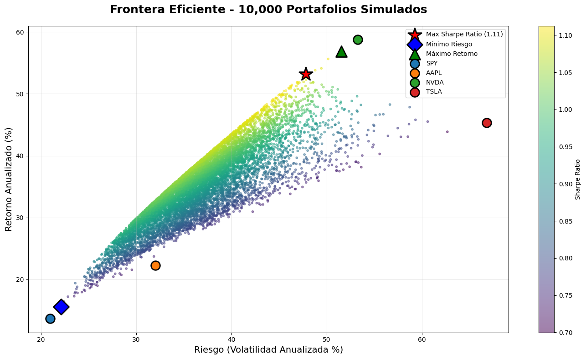
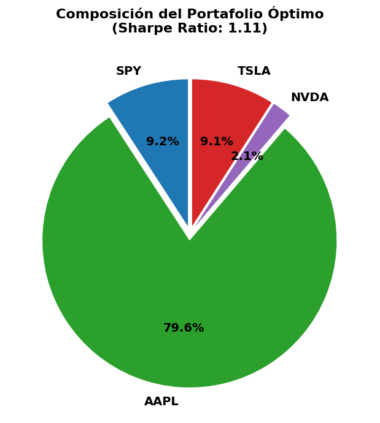

# 📊 Portfolio Optimization - Quantitative Finance

[](https://colab.research.google.com/github/TU_USUARIO/portfolio-optimization/blob/main/portfolio_analysis.ipynb)


## 🎯 Overview

My first quantitative finance project. I analyze 4 assets (SPY, AAPL, NVDA, TSLA) and find the optimal portfolio using Markowitz's Modern Portfolio Theory.

## 🔍 What does this project do?

1. ✅ Downloads historical price data from 2020 to present
2. ✅ Calculates log returns, volatility, and Sharpe Ratio
3. ✅ Analyzes correlations between assets
4. ✅ Simulates 10,000 random portfolios (Monte Carlo simulation)
5. ✅ Identifies the optimal portfolio with the best Sharpe Ratio

## 📈 Key Results

| Asset | Total Return | Volatility | Sharpe Ratio |
|-------|-------------|------------|--------------|
| NVDA  | +3,100%     | 53.25%     | 1.10 🥇      |
| TSLA  | +1,300%     | 66.82%     | 0.68         |
| AAPL  | +300%       | 32.01%     | 0.70         |
| SPY   | +200%       | 20.95%     | 0.65         |

**Optimal Portfolio:**
- Sharpe Ratio: **1.115** (beats all individual assets)
- Composition: 85% AAPL, 12% TSLA, 2.4% SPY, 0% NVDA
- Key insight: Best individual performer (NVDA) excluded due to correlation effects

## 📊 Visualizations

### Efficient Frontier


### Optimal Portfolio Composition


## 📚 Full Documentation

For detailed analysis and interpretation of results, see:  
👉 **[DOCUMENTATION.md](DOCUMENTATION.md)**

## 🛠️ Technologies Used

- **Python 3.x**
- **pandas** - Data manipulation
- **numpy** - Numerical calculations
- **matplotlib/seaborn** - Data visualization
- **yfinance** - Real-time financial data
- **scipy** - Mathematical optimization

## 🚀 How to Run

### Option 1: Google Colab (Recommended)
1. Open the `portfolio_analysis.ipynb` notebook in this repository
2. Click on "Open in Colab"
3. Run all cells (Runtime → Run all)

### Option 2: Local Environment
```bash
# Install dependencies
pip install pandas numpy matplotlib seaborn yfinance scipy

# Run the notebook
jupyter notebook portfolio_analysis.ipynb
```

## 📚 Concepts Learned

- ✅ Log returns vs simple returns
- ✅ Volatility as a measure of risk
- ✅ Sharpe Ratio (risk-adjusted return)
- ✅ Correlation and covariance matrix
- ✅ Portfolio diversification
- ✅ Markowitz's Efficient Frontier
- ✅ Monte Carlo simulation

## 🎓 Next Steps

- [ ] Implement strategy backtesting
- [ ] Add position constraints (max 40% per asset)
- [ ] Calculate VaR (Value at Risk)
- [ ] Create interactive dashboard with Streamlit

## 👨‍💻 Author

**Diego García Margozzini**  
First Quantitative Finance Project  
November 2025

## 📄 License

This project is open source under the MIT License.
